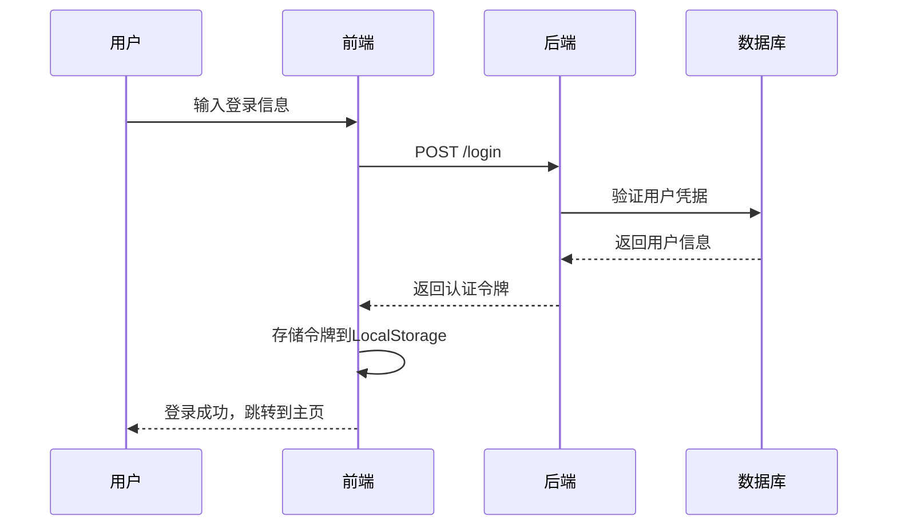
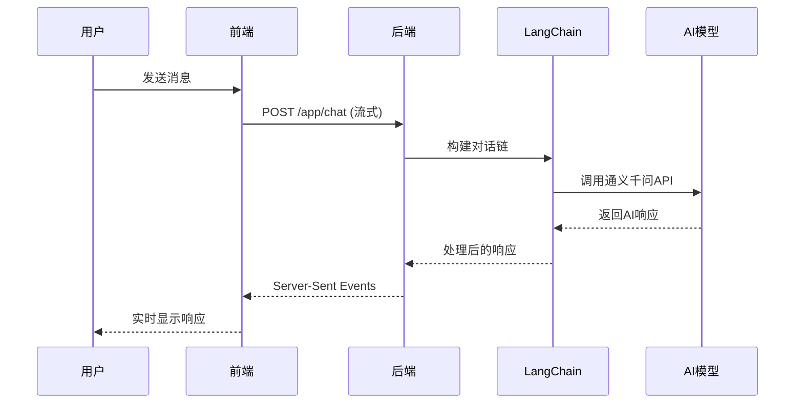
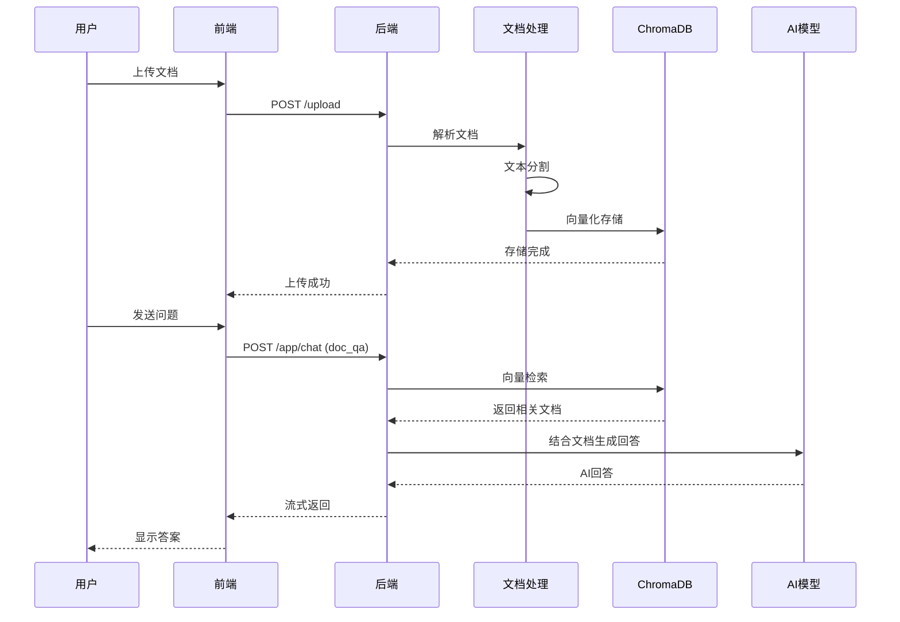

# 技术架构设计

## 🏗️ 整体架构

智能游戏对话系统采用现代化的前后端分离架构，结合微服务思想和 AI 技术，构建了一个高性能、可扩展的智能问答平台。

```
┌─────────────────────────────────────────────────────────────┐
│                        用户界面层                             │
│  ┌─────────────────┐  ┌─────────────────┐  ┌─────────────────┐ │
│  │    登录注册      │  │    对话界面      │  │    收藏管理      │ │
│  └─────────────────┘  └─────────────────┘  └─────────────────┘ │
└─────────────────────────────────────────────────────────────┘
                                │
                         HTTP/WebSocket
                                │
┌─────────────────────────────────────────────────────────────┐
│                        API 网关层                            │
│  ┌─────────────────┐  ┌─────────────────┐  ┌─────────────────┐ │
│  │   FastAPI 路由   │  │   CORS 中间件    │  │   认证中间件     │ │
│  └─────────────────┘  └─────────────────┘  └─────────────────┘ │
└─────────────────────────────────────────────────────────────┘
                                │
                                │
┌─────────────────────────────────────────────────────────────┐
│                        业务逻辑层                             │
│  ┌─────────────────┐  ┌─────────────────┐  ┌─────────────────┐ │
│  │   用户管理服务    │  │   对话服务       │  │   文档服务       │ │
│  └─────────────────┘  └─────────────────┘  └─────────────────┘ │
└─────────────────────────────────────────────────────────────┘
                                │
                                │
┌─────────────────────────────────────────────────────────────┐
│                        AI 服务层                             │
│  ┌─────────────────┐  ┌─────────────────┐  ┌─────────────────┐ │
│  │   LangChain     │  │   通义千问 API   │  │   向量检索       │ │
│  └─────────────────┘  └─────────────────┘  └─────────────────┘ │
└─────────────────────────────────────────────────────────────┘
                                │
                                │
┌─────────────────────────────────────────────────────────────┐
│                        数据存储层                             │
│  ┌─────────────────┐  ┌─────────────────┐  ┌─────────────────┐ │
│  │    SQLite       │  │    ChromaDB     │  │   本地文件       │ │
│  │   (用户数据)     │  │   (向量数据)     │  │   (上传文档)     │ │
│  └─────────────────┘  └─────────────────┘  └─────────────────┘ │
└─────────────────────────────────────────────────────────────┘
```

## 🎯 核心组件详解

### 1. 前端架构 (React 生态)

#### 组件层次结构
```
App (根组件)
├── AuthContext (认证上下文)
├── ThemeContext (主题上下文)
├── FunctionContext (功能上下文)
├── Router (路由系统)
│   ├── PublicWelcome (公开欢迎页)
│   ├── Login (登录页)
│   ├── Register (注册页)
│   ├── Welcome (用户欢迎页)
│   └── Chat (主对话页)
│       ├── Sidebar (侧边栏)
│       ├── ChatHistory (聊天历史)
│       ├── InputBar (输入框)
│       └── ChatBubble (对话气泡)
└── ErrorBoundary (错误边界)
```

#### 状态管理
- **Context API**：全局状态管理
- **本地状态**：组件内部状态
- **LocalStorage**：持久化数据存储

#### 路由设计
- **保护路由**：需要认证的页面
- **公开路由**：无需认证的页面
- **动态路由**：基于用户角色的权限控制

### 2. 后端架构 (FastAPI + Python)

#### 模块化设计
```python
backend/
├── main.py              # 应用入口和路由定义
├── models.py            # Pydantic 数据模型
├── auth.py              # 用户认证和授权
├── database.py          # 数据库操作封装
├── llm_chain.py         # AI对话链管理
├── document_processing.py  # 文档处理服务
└── config.py            # 配置管理
```

#### API 设计模式
- **RESTful API**：标准的 REST 接口
- **流式 API**：Server-Sent Events 实现实时对话
- **上传 API**：多部分表单数据处理
- **认证 API**：基于 Token 的身份验证

#### 中间件栈
```python
FastAPI Application
├── CORSMiddleware       # 跨域资源共享
├── AuthMiddleware       # 用户认证检查
├── LoggingMiddleware    # 请求日志记录
└── ErrorHandlerMiddleware  # 全局错误处理
```

### 3. AI 服务架构

#### LangChain 集成
```python
AI 服务层
├── LLM 管理
│   ├── 通义千问模型初始化
│   ├── 模型参数配置
│   └── 错误恢复机制
├── 对话链设计
│   ├── 通用对话链
│   ├── 游戏推荐链
│   ├── 攻略查询链
│   └── 文档问答链
├── 记忆管理
│   ├── 用户级别记忆隔离
│   ├── 功能级别记忆分类
│   └── 自动清理机制
└── Prompt 工程
    ├── 角色设定模板
    ├── 上下文注入
    └── 输出格式控制
```

#### RAG 文档问答系统
```python
文档处理流程
├── 文档上传
│   ├── 格式验证 (PDF/DOCX/TXT)
│   ├── 大小限制检查
│   └── 安全扫描
├── 文档解析
│   ├── PDF: PyPDF2
│   ├── DOCX: python-docx
│   └── TXT: 编码自动检测
├── 文本分割
│   ├── RecursiveCharacterTextSplitter
│   ├── 语义边界保持
│   └── 重叠窗口设计
├── 向量化存储
│   ├── Ollama 嵌入模型
│   ├── ChromaDB 持久化
│   └── 索引优化
└── 相似度检索
    ├── 语义相似度计算
    ├── Top-K 结果筛选
    └── 上下文重排序
```

### 4. 数据存储架构

#### 多层存储设计
```sql
-- 用户数据 (SQLite)
users
├── id (主键)
├── username (用户名)
├── email (邮箱)
├── password_hash (密码哈希)
├── salt (盐值)
├── created_at (创建时间)
├── updated_at (更新时间)
├── is_active (是否激活)
└── is_admin (是否管理员)
```

```javascript
// 向量数据 (ChromaDB)
文档向量集合
├── document_id (文档标识)
├── chunk_id (分块标识)
├── embedding_vector (嵌入向量)
├── metadata (元数据)
│   ├── source (来源文档)
│   ├── page (页码)
│   ├── chunk_index (分块索引)
│   └── upload_time (上传时间)
└── text_content (原始文本)
```

```javascript
// 客户端存储 (LocalStorage)
用户会话数据
├── authToken (认证令牌)
├── userId (用户ID)
├── userInfo (用户信息)
├── chatHistory (对话历史)
│   ├── general (通用对话)
│   ├── play (游戏推荐)
│   ├── game_guide (游戏攻略)
│   ├── doc_qa (文档问答)
│   └── game_wiki (游戏百科)
└── gameCollection (游戏收藏)
    ├── games[] (游戏列表)
    ├── categories[] (分类信息)
    └── statistics (统计数据)
```

## 🔄 数据流设计

### 1. 用户认证流程


### 2. 智能对话流程


### 3. 文档问答流程


## 🛡️ 安全架构

### 1. 认证与授权
- **密码安全**：PBKDF2 + Salt 哈希存储
- **会话管理**：基于 Token 的无状态认证
- **权限控制**：基于角色的访问控制

### 2. 数据安全
- **输入验证**：Pydantic 模型验证
- **SQL 注入防护**：参数化查询
- **XSS 防护**：输出编码和 CSP 头

### 3. API 安全
- **CORS 配置**：精确的跨域资源控制
- **速率限制**：防止 API 滥用
- **错误处理**：避免敏感信息泄露

## ⚡ 性能优化

### 1. 前端优化
- **代码分割**：Vite 动态导入
- **懒加载**：组件按需加载
- **缓存策略**：LocalStorage 和浏览器缓存

### 2. 后端优化
- **异步处理**：FastAPI 异步编程
- **连接池**：数据库连接复用
- **流式响应**：大数据量分块传输

### 3. AI 服务优化
- **记忆管理**：智能上下文截断
- **模型缓存**：减少重复初始化
- **并发控制**：限制同时处理请求数量

## 📈 可扩展性设计

### 1. 水平扩展
- **无状态设计**：支持多实例部署
- **负载均衡**：支持反向代理
- **分布式存储**：支持数据库集群

### 2. 功能扩展
- **插件架构**：模块化功能添加
- **API 版本控制**：向后兼容性
- **配置中心**：动态配置管理

### 3. 监控与运维
- **日志系统**：结构化日志记录
- **健康检查**：服务状态监控
- **性能指标**：关键指标采集
